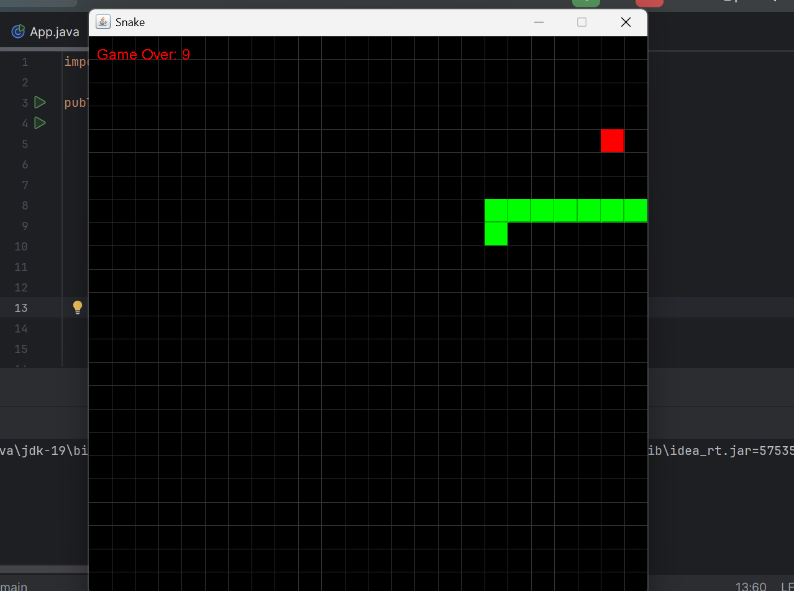

 jeu du serpent en Java en utilisant les bibliothèques graphiques AWT et Swing.

Créer une interface graphique (GUI) pour afficher le jeu du serpent.
Mettre en place une boucle de jeu.
Gérer les événements de clavier pour déplacer le serpent.
Utiliser une ArrayList pour stocker les segments du serpent.
Vérifier les collisions et les sorties de limites pour déclencher la fin de la partie.

